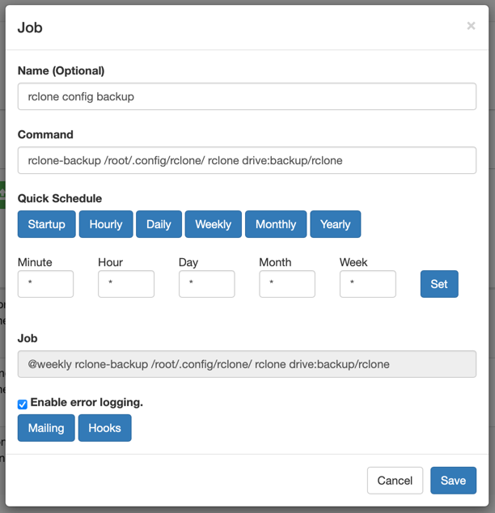

# rclone-backup

I needed a way to backup app data from my Raspberry, so I made this image that combines [rclone](https://rclone.org) and [crontab-ui](https://github.com/alseambusher/crontab-ui).
Plus an extra shell script that can zip a folder and send it to rclone.

## Install

I use it with Portainer docker-compose:

```yaml
services:
  rclone-backup:
    container_name: rclone-backup
    image: fyodorvy/rclone-backup:0.4
    ports:
      - 8080:8080
    environment:
      - CRON_DB_PATH=/crontab-ui
      # this is optional, have a look at crontab-ui possible env vars
      - ENABLE_AUTOSAVE=true
    volumes:
      # your rclone config file, easy way is to set it up on your local machine and then copy the file across
      - ./config:/root/.config/rclone/
      # crontab-ui folder that will contain jobs and logs
      - ./crontab-ui:/crontab-ui
      # any extra volumes you're planing to backup
      - ./data:/data
    restart: always
```

## Usage

Extra script that comes with this image has simple usage:

```shell
rclone-backup <path> <name> <rclone-destination>
```

Example:

```shell
rclone-backup /data/homepage homepage drive:backup/homepage
```
Where: 

`/data/homepage` is a path to what you want to backup, can be a folder or file.

`homepage` name of the back, will be used in generated zip filename, so it will look like `homepage_2024-11-23_18-08-59.zip`

`drive:backup/homepage` is rclone destination, where `drive` is the name of your configured remote and `backup/homepage` is the path within that remote.

After starting up the container you can access crontab-ui and add crontab scripts. I actually backup rclone config itself:

